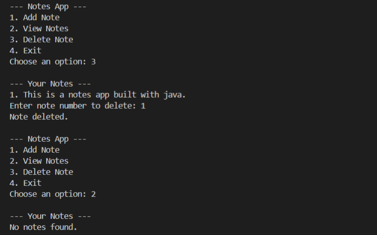

# Notes App

A simple text-based notes manager built in Java. It allows you to add, view, and delete notes, with all notes persisted in a text file using FileReader/FileWriter.

## Features
- Add a note
- View all notes
- Delete a note by number
- Persistent storage in `src/notes.txt`

## How to Run
1. Open a terminal in the project root.
2. Compile the app:
   ```sh
   javac src/NotesApp.java
   ```
3. Run the app:
   ```sh
   java -cp src NotesApp
   ```

## Screenshots
Below are screenshots of the app running in the terminal:

### Adding a note


### Viewing notes


### Deleting a note


### Exiting the app


## Requirements
- Java 8 or higher
- Terminal/Command Prompt

## File Structure
```
Notes App/
├── src/
│   ├── NotesApp.java
│   └── notes.txt
├── screenshots/
│   ├── add_note.png
│   ├── view_notes.png
│   ├── delete_note.png
│   └── exit.png
└── README.md
```

## Author
Arpit Yadav
